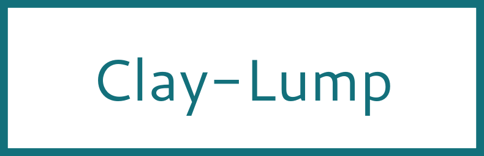

 


<!---
This file is generated by ape-tmpl. Do not update manually.
--->

<!-- Badge Start -->
<a name="badges"></a>

[![Build Status][bd_travis_shield_url]][bd_travis_url]
[![npm Version][bd_npm_shield_url]][bd_npm_url]
[![JS Standard][bd_standard_shield_url]][bd_standard_url]

[bd_repo_url]: https://github.com/realglobe-Inc/clay-lump
[bd_travis_url]: http://travis-ci.org/realglobe-Inc/clay-lump
[bd_travis_shield_url]: http://img.shields.io/travis/realglobe-Inc/clay-lump.svg?style=flat
[bd_travis_com_url]: http://travis-ci.com/realglobe-Inc/clay-lump
[bd_travis_com_shield_url]: https://api.travis-ci.com/realglobe-Inc/clay-lump.svg?token=
[bd_license_url]: https://github.com/realglobe-Inc/clay-lump/blob/master/LICENSE
[bd_codeclimate_url]: http://codeclimate.com/github/realglobe-Inc/clay-lump
[bd_codeclimate_shield_url]: http://img.shields.io/codeclimate/github/realglobe-Inc/clay-lump.svg?style=flat
[bd_codeclimate_coverage_shield_url]: http://img.shields.io/codeclimate/coverage/github/realglobe-Inc/clay-lump.svg?style=flat
[bd_gemnasium_url]: https://gemnasium.com/realglobe-Inc/clay-lump
[bd_gemnasium_shield_url]: https://gemnasium.com/realglobe-Inc/clay-lump.svg
[bd_npm_url]: http://www.npmjs.org/package/clay-lump
[bd_npm_shield_url]: http://img.shields.io/npm/v/clay-lump.svg?style=flat
[bd_standard_url]: http://standardjs.com/
[bd_standard_shield_url]: https://img.shields.io/badge/code%20style-standard-brightgreen.svg

<!-- Badge End -->


<!-- Description Start -->
<a name="description"></a>

Lump of clay-db

<!-- Description End -->


<!-- Overview Start -->
<a name="overview"></a>


<!-- Overview End -->


<!-- Sections Start -->
<a name="sections"></a>

<!-- Section from "doc/guides/00.TOC.md.hbs" Start -->

<a name="section-doc-guides-00-t-o-c-md"></a>

Table of Contents
----------------

- [Installation](#installation)
- [Usage](#usage)
- [Advanced Usage](#advanced-usage)
  * [Applying Policies](#applying-policies)
  * [Listening to events](#listening-to-events)
- [API Guide](#api-guide)
- [License](#license)
- [Links](#links)


<!-- Section from "doc/guides/00.TOC.md.hbs" End -->

<!-- Section from "doc/guides/01.Installation.md.hbs" Start -->

<a name="section-doc-guides-01-installation-md"></a>

Installation
-----

```bash
$ npm install clay-lump --save
```


<!-- Section from "doc/guides/01.Installation.md.hbs" End -->

<!-- Section from "doc/guides/02.Usage.md.hbs" Start -->

<a name="section-doc-guides-02-usage-md"></a>

Usage
---------

Three steps to use use clay lump.

1. Create lump instance with `clayLump(config)`.
2. Access resource with `lump.resource(resourceName)`
3. Use resource methods like `resource.create()` or `resource.list()` to handle data

```javascript
'use strict'

const clayLump = require('clay-lump')
const {SqliteDriver} = require('clay-driver-sqlite')

async function exampleClayLump () {
  let lump01 = clayLump('lump01', {
    driver: new SqliteDriver('var/example-lump01.db')
  })

  {
    const Dog = lump01.resource('Dog@default')

    let john = await Dog.create({name: 'john', type: 'Saint Bernard', age: 3})
    console.log(john) // -> { id: '1a6358694adb4aa89c15f94be50d5b78', name: 'john', type: 'Saint Bernard', age: 3 }

    let dogs = await Dog.list({
      filter: {type: 'Saint Bernard'},
      page: {number: 1, size: 25}
    })
  }

  let lump02 = clayLump('lump02')
  {
    const Dog = lump02.resource('Dog@foo')
    let bess = await Dog.create({name: 'bess', type: 'Chihuahua', age: 1})

    const Dog2 = lump02.resource('Dog@bar')
    let bess2 = await Dog.create({name: 'bess2', type: 'Chihuahua', age: 1})
  }

  // Sync lumps01 to lump02
  await lump02.sync(lump01) // Both lumps will be updated
  {
    const Dog = lump02.resource('Dog')
    let [john] = (await Dog.list({filter: {name: 'john'}})).entities // Synced from lump01
    console.log(john) // -> { id: '1a6358694adb4aa89c15f94be50d5b78', name: 'john', type: 'Saint Bernard', age: 3 }
  }
}

exampleClayLump().catch((err) => console.error(err))


```

For more detail, see [API Guide](./doc/api/api.md)


<!-- Section from "doc/guides/02.Usage.md.hbs" End -->

<!-- Section from "doc/guides/03.Advanced Usage.md.hbs" Start -->

<a name="section-doc-guides-03-advanced-usage-md"></a>

Advanced Usage
--------------

### Applying Policies

To restrict data structure of resources, you can pass [ClayPolicy]([https://github.com/realglobe-Inc/clay-policy])
to `policies` options of clay lump constructor.

```javascript
'use strict'

const clayLump = require('clay-lump')
const {STRING, DATE} = clayLump.Types

async function exampleClayLump () {
  let lump02 = clayLump('lump02')

  // Define policy on resource
  lump02.resource('User').policy({
    username: {
      type: STRING,
      required: true
    },
    birthday: {
      type: DATE
    },
    rank: {
      type: STRING,
      oneOf: ['GOLD', 'SLIVER', 'BRONZE']
    }
  })

  // Use the resource with policy
  {
    const User = lump02.resource('User')
    let user01 = await User.create({username: 'foo', rank: '__INVALID_RANK__'}) // -> Throws policy error
    /* ... */
  }

  // Use policy as validator
  {
    const User = lump02.resource('User')
    let policy = User.getPolicy()
    policy.validateToThrow({foo: 'bar'})
  }
}

exampleClayLump().catch((err) => console.error(err))

```


### Listening to events

Resources are instances of [EventEmitter](https://nodejs.org/api/events.html) and fires events.
See [ResourceEvents](https://github.com/realglobe-Inc/clay-constants#ResourceEvents) to know what you can listen.

```javascript
'use strict'

const clayLump = require('clay-lump')
const {ResourceEvents} = clayLump

// Events fired from resource
const {
  ENTITY_CREATE,
  ENTITY_CREATE_BULK,
  ENTITY_UPDATE,
  ENTITY_UPDATE_BULK,
  ENTITY_DESTROY,
  ENTITY_DESTROY_BULK,
  ENTITY_DROP
} = ResourceEvents

async function exampleClayLump () {
  let lump02 = clayLump('lump02')

  // Add listener on resource
  lump02.resource('User')
    .on(ENTITY_CREATE, ({created}) => { /* ... */ })
    .on(ENTITY_CREATE_BULK, ({created}) => { /* ... */ })
    .on(ENTITY_UPDATE, ({id, updated}) => { /* ... */ })
    .on(ENTITY_UPDATE_BULK, ({ids, updated}) => { /* ... */ })
    .on(ENTITY_DESTROY, ({id, destroyed}) => { /* ... */ })
    .on(ENTITY_DESTROY_BULK, ({ids, destroyed}) => { /* ... */ })
    .on(ENTITY_DROP, ({dropped}) => { /* ... */ })

  // Use the resource with policy
  {
    const User = lump02.resource('User')
    console.log(User.getPolicy()) // -> Returns policy info

    let user01 = await User.create({username: 'foo', rank: '__INVALID_RANK__'}) // -> Throws policy error
    /* ... */
  }
}

exampleClayLump().catch((err) => console.error(err))

```


<!-- Section from "doc/guides/03.Advanced Usage.md.hbs" End -->

<!-- Section from "doc/guides/10.API Guide.md.hbs" Start -->

<a name="section-doc-guides-10-a-p-i-guide-md"></a>

API Guide
-----

+ [clay-lump@4.2.4](./doc/api/api.md)
  + [create()](./doc/api/api.md#clay-lump-function-create)
  + [isLump(instance)](./doc/api/api.md#clay-lump-function-is-lump)
  + [ClayLump](./doc/api/api.md#clay-lump-class)
  + [DriverMixed](./doc/api/api.md#driver-mixed-class)
  + [MergeMixed](./doc/api/api.md#merge-mixed-class)
  + [PolicyMixed](./doc/api/api.md#policy-mixed-class)
  + [ResourceMixed](./doc/api/api.md#resource-mixed-class)


<!-- Section from "doc/guides/10.API Guide.md.hbs" End -->


<!-- Sections Start -->


<!-- LICENSE Start -->
<a name="license"></a>

License
-------
This software is released under the [Apache-2.0 License](https://github.com/realglobe-Inc/clay-lump/blob/master/LICENSE).

<!-- LICENSE End -->


<!-- Links Start -->
<a name="links"></a>

Links
------

+ [ClayDB][clay_d_b_url]
+ [Realglobe, Inc.][realglobe,_inc__url]

[clay_d_b_url]: https://github.com/realglobe-Inc/claydb
[realglobe,_inc__url]: http://realglobe.jp

<!-- Links End -->
